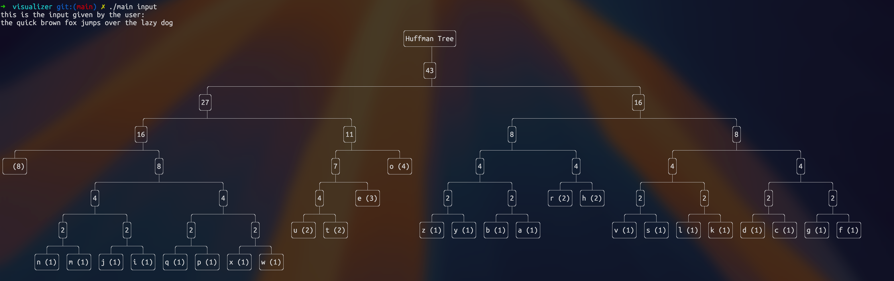

# Huffman Encoding Visualizer

The Huffman Encoding Visualizer is a Go-based tool designed to visualize the Huffman encoding process. Utilizing the `treedrawer` library by m1gwings, this project allows users to explore the intricacies of Huffman coding, a popular algorithm for data compression.

## Example Usage

</a>

## Table of Contents

- [Overview](#overview)
- [Features](#features)
- [Getting Started](#getting-started)
- [Usage](#usage)
- [Input Format](#input-format)
- [Visualization](#visualization)
- [How Huffman Encoding Works](#how-huffman-encoding-works)
- [Contributing](#contributing)
- [License](#license)

## Overview

Huffman coding is a method used for lossless data compression. This visualizer allows users to input a text string, which is then processed to generate a Huffman tree and corresponding codes. The tree is visualized, providing insights into the encoding mechanism.

## Features

- **Huffman Tree Visualization**: Displays the Huffman tree structure for the given input.
- **Huffman Code Generation**: Generates Huffman codes for each character in the input text.
- **Frequency Analysis**: Prints a frequency array showing the number of occurrences of each character.
- **User-Friendly Interface**: Simple command-line interface for easy input and output.
